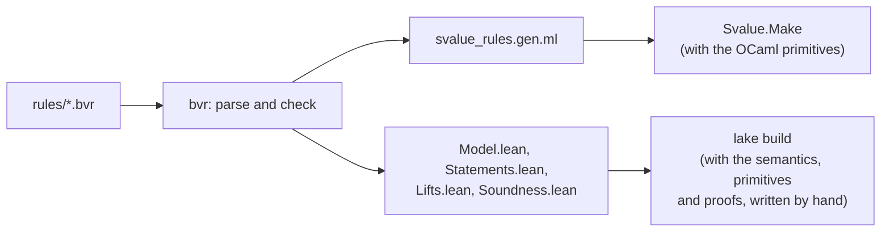

# bvr: the rule language of Bv_values

`Bv_values.Svalue` simplifies terms as it builds them: `BitVec.add x 0` returns
`x`, `Bool.and_ p (not p)` returns `false`, and so on. These *smart
constructors* are what keeps the terms sent to the SMT solver small, but they
are also easy to get wrong: a simplification that is almost always right
makes Soteria unsound, and the bug is very hard to notice.

bvr is a small language in which these simplifications are written, once, as
rewrite rules. From the rules, the `bvr` tool generates:

- the **OCaml implementation** of the smart constructors, which is what
  Soteria runs;
- a **Lean model** of the same rules, together with one **soundness
  statement** per rule, which are proved in Lean.

As a result, every simplification that Soteria makes is proved correct with
respect to the SMT-LIB meaning of terms, and the proofs are checked by CI.
Adding or changing a rule needs no Lean in most cases: the proof is found
automatically.

This file describes the architecture. The language itself is described in
[SYNTAX.md](SYNTAX.md).

- [Overview](#overview)
- [Where things are](#where-things-are)
- [From rules to OCaml](#from-rules-to-ocaml)
- [From rules to Lean](#from-rules-to-lean)
- [What is proved and what is trusted](#what-is-proved-and-what-is-trusted)
- [Working with the rules](#working-with-the-rules)

## Overview



A rule looks like this:

```ocaml
rule bv_not (v : t) : BvNot v <| ty v =
  match v with
  | lit: #bv -> ~bv
  | ite: Ite (b, l, r) -> b_ite b (~l) (~r)
```

`bv_not` is the smart constructor of bitwise negation. `BvNot v <| ty v`, its
*spec*, is the raw, unsimplified node that it stands for. Each case of the
`match` is a rule with a name (`lit`, `ite`): if `v` is a literal, negate it;
if it is an `ite`, push the negation into its branches. When no rule applies,
the result is the spec itself. What is proved of each rule is that its result means the
same thing as the spec.

## Where things are

| path | contents |
|---|---|
| `soteria/lib/bv_values/rules/*.bvr` | the rules: `prelude.bvr` (primitives and helpers), `bool.bvr`, `bitvec.bvr`, `float.bvr`, `ptr.bvr` |
| `soteria/lib/bv_values/svalue_rules.gen.ml` | the generated OCaml (committed) |
| `soteria/lib/bv_values/svalue.ml` | the OCaml primitives (`Prims`), and the public API, which calls the generated functions |
| `soteria/bvr/` | the `bvr` tool |
| `soteria/bvr/ppx/` | `[%%include_file]`, the ppx that includes the generated OCaml in `svalue.ml` |
| `soteria/bvr/lean/` | the Lean project |

The tool itself:

| file | role |
|---|---|
| `bvr_lexer.mll`, `bvr_parser.mly` | parse `.bvr` files into an OCaml parse tree |
| `check.ml` | type-check it, reject what is not bvr, and desugar it into the typed syntax of `syntax.ml` |
| `syntax.ml` | the typed syntax, and the list of the constructors of terms (with their OCaml and Lean names) |
| `gen_ocaml.ml` | the OCaml backend |
| `gen_lean.ml` | the Lean backend |
| `main.ml` | the command line: `bvr (ocaml \| lean-model \| lean-statements \| lean-lifts \| lean-soundness) FILE...` |

The Lean project (`soteria/bvr/lean/Bvr/`):

| file | written by | contents |
|---|---|---|
| `Syntax.lean` | hand | terms, as in `svalue_ast.ml` |
| `Float.lean` | hand | IEEE floats as bit patterns |
| `Prims.lean` | hand | the primitives, as in `svalue.ml` |
| `Semantics.lean` | hand | the meaning of terms, and of soundness |
| `Model.lean` | bvr | the rules, as Lean functions |
| `Statements.lean` | bvr | one soundness statement per rule |
| `Lifts.lean` | bvr | lemmas used by the tactics |
| `Soundness.lean` | bvr | the proof of the whole simplifier, from the proofs of the rules |
| `Lemmas.lean`, `Lib/` | hand | lemmas and tactics that prove most rules automatically |
| `Proofs/` | hand | proofs of the rules that the tactics cannot prove |

## From rules to OCaml

`bvr ocaml` turns every function of the rules into an OCaml function, and
every `match` into an OCaml `match`: the rules are tried in order, and the
first one that matches (with its guard) gives the result. The `match` of a
rule function gets a last case `_ -> spec`, if it has none that always
matches. The output is
`svalue_rules.gen.ml`, which is not meant to be read. It is optimised (it
inlines small helpers and avoids decoding literals it does not use), so that
the generated smart constructors are as fast as hand-written ones.

The generated file is a fragment of a module, in terms of a module `P` of
primitives. `svalue.ml` includes it inside the `Svalue.Make` functor, next to
the primitives, with

```ocaml
module R = struct
  module P = Prims
  [%%include_file "svalue_rules.gen.ml"]
end
```

and exposes its functions in the API: `BitVec.add` is `R.bv_add`,
`Bool.and_` is `R.b_and`, and so on. Including the file (rather than
compiling it as a separate module) lets OCaml inline the primitives.

dune regenerates `svalue_rules.gen.ml` when the rules change, and copies it
back to the source tree (`(mode promote)`), so that it is committed and its
changes appear in reviews.

## From rules to Lean

This part explains the proofs for readers who do not know Lean. Lean is a
programming language in which one can also state theorems about programs and
prove them. Lean checks the proofs: if `lake build` succeeds, every theorem is
proved, and nothing needs to be taken on trust but the definitions and the
statements.

### Semantics: what terms mean

`Semantics.lean` defines the value of a term, `eval FS ρ t`, under an
assignment `ρ` of values to the symbolic variables. It follows the SMT-LIB
encoding of terms (`encoding.ml`): booleans, bit-vectors of each width,
pointers, floats, sequences. Some terms have no value, which is written
`none`, and called *poison*:

- ill-typed terms, such as the sum of a boolean and a bit-vector;
- checked operations that overflow: `Add ({ signed = true; _ }, a, b)` promises
  that the signed sum of `a` and `b` does not overflow, and has no value when
  it does;
- `ite` only evaluates the branch it selects, and `&&` and `||` are
  "parallel": `false && x` is `false` even if `x` is poison.

Floats are exact IEEE bit patterns, and float arithmetic is left abstract
(`FloatSem`): the proofs hold for any implementation of it.

### Soundness: refinement

A term `r` *refines* a term `spec` (`Refines FS spec r`) when:

1. if `spec` is well-typed, `r` is well-typed and has the same type; and
2. for every assignment of the variables, if `spec` has a value, then `r`
   has the same value.

A smart constructor is sound when its result refines its spec, the raw node.
So a simplification may turn a poisoned term into anything, but must preserve
the value of every term that has one. Under a model of the path condition,
all the overflow checks hold, and refinement is plain equality.

### The model of the rules

`bvr lean-model` generates `Model.lean`, a Lean version of the rules:

```lean
def bv_not.r_ite (O : Ops) (v : Term) : Option Term :=
  (match v with
    | (Term.mk (Kind.triop Triop.ite b l r) _) =>
    (whenSome true ((O.b_ite b (O.bv_not l) (O.bv_not r))))
    | _ => none)
```

Each rule becomes a function that returns `some result` if it applies and
`none` otherwise. `bv_not.step` tries the rules in order, and returns the spec
if none applies.

The rules call each other, and themselves, recursively. Rather than assuming
that these calls terminate, the model goes through a record `O : Ops` of all
the rule functions (the calls are `O.b_ite`, `O.bv_not`, ...), and builds the
simplifier by steps: `opsN orc 0` returns every spec unchanged, and
`opsN orc (n + 1)` runs each rule function once, with `opsN orc n` for the
recursive calls. `orc` holds the oracles (see
[What is proved](#what-is-proved-and-what-is-trusted)).

### The statements

`bvr lean-statements` generates `Statements.lean`, with one statement per
*alternative* of each rule. An alternative is a rule after its or-patterns
and the swaps of commutative operands (see [SYNTAX.md](SYNTAX.md)) have been
expanded, so that it has a single pattern. Its statement says that, for any
values of its pattern variables for which the guard holds, the result of the
rule refines the spec on the matched term. For the `ite` rule of `bv_not`:

```lean
def bv_not.r_ite.a1.Stmt : Prop :=
  ∀ (FS : FloatSem) (O : Ops), O.Sound FS →
  ∀ (b : Term) (l : Term) (r : Term) (t__5 : Ty),
  Refines FS (bv_not.spec (Term.mk (Kind.triop Triop.ite b l r) t__5))
  ((O.b_ite b (O.bv_not l) (O.bv_not r)))
```

This reads: for any float semantics `FS`, and any rule functions `O` that are
sound (`O.Sound FS`: each of them refines its spec), for any terms `b`, `l`,
`r` and type `t__5`, the result `b_ite b (~l) (~r)` refines
`BvNot (ite(b, l, r))`. Assuming that the recursive calls are sound is what
makes each rule provable on its own.

These statements are what a reviewer should read: they are generated from
the rules, so they say exactly what the rules do, and the definitions they
use (`Refines`, `eval`) are those of `Semantics.lean`.

### The proofs

- **Most alternatives are proved automatically.** An alternative
  `f.r_name.aI` is proved by `f.r_name.aI.proof` if there is such a theorem
  in `Proofs/`, and otherwise by the tactic of the library of `f` (see
  `bvr_proof%` in `Lib/Rule.lean`). A tactic is a program that searches for a
  proof: the tactics of `Lib/` replace the calls to rule functions by their
  specs, check the types, and reduce the goal to a statement about bit-vector
  values, which Lean's decision procedures then solve.
- **The others have a hand-written proof** in `Proofs/*Cases.lean`, usually a
  few lines, using a lemma about bit-vectors.
- **An alternative that only swaps commutative operands** is proved from the
  unswapped one.
- **`Soundness.lean`** (generated) puts everything together: it proves each
  rule from its alternatives, each rule function from its rules, and
  finally, by induction on the number of steps, the soundness of the whole
  simplifier:

  ```lean
  theorem opsN_sound (FS : FloatSem) (orc : Oracle) (h : orc.Compat FS) :
      ∀ n, (opsN orc n).Sound FS
  ```

  That is: for any float semantics and any oracles compatible with it, and
  any number of steps, every smart constructor refines its spec.

CI runs `lake build`, which checks all the proofs, and checks that
`opsN_sound` depends on no `sorry` (Lean's placeholder for a missing proof),
with `check_axioms.lean`.

## What is proved and what is trusted

The theorem is about the Lean model of the rules. It applies to the OCaml
code that Soteria runs under the following assumptions, which are not proved:

- **The semantics.** `Semantics.lean` gives terms the meaning that
  `encoding.ml` gives them when it sends them to the solver.
- **The primitives.** The primitives declared with `prim` in `prelude.bvr`
  are implemented twice, in `svalue.ml` and in `Prims.lean`, and the two
  implementations agree. Where the OCaml one raises an exception (e.g. on a
  term of the wrong kind), the Lean one returns an arbitrary value, so the
  theorem covers every result that the OCaml code actually returns.
- **The oracles.** The primitives declared with `oracle` (the hash-consing
  order, and Floatml's float arithmetic) have no Lean definition. The proofs
  only assume what `Oracle.Compat` states: that sorting by tags reorders a
  list, and that Floatml computes the same floats as `FloatSem`.
- **The backends.** `gen_ocaml.ml` and `gen_lean.ml` translate the same
  checked program, and are trusted to translate it the same way.
- **Terms as trees.** In Lean, terms are trees, and the equality of
  hash-consed terms in OCaml is their structural equality.
- **Recursion.** Every OCaml result that is computed is also computed by the
  model in some finite number of steps, and so is covered by `opsN_sound`.
- **`assert`.** The Lean model ignores the `assert`s of the rules: the proofs
  do not rely on them.

## Working with the rules

### Commands

```bash
dune build                      # regenerates svalue_rules.gen.ml
dune test soteria/bvr           # checks that the generated Lean files are up to date
dune promote                    # updates them
cd soteria/bvr/lean && lake build   # checks the proofs
```

`lake` is installed by [elan](https://github.com/leanprover/elan); the first
`lake build` downloads the Lean version of `lean-toolchain`.

### Changing or adding a rule

1. Edit the `.bvr` file (see [SYNTAX.md](SYNTAX.md)). Give the new case a
   name.
2. Run `dune build` and `dune test soteria/bvr`, then `dune promote`, and
   commit the regenerated files along with the rules.
3. Run `lake build` in `soteria/bvr/lean`. In most cases, it succeeds and
   there is nothing else to do.
4. If it fails, the error is in `Soundness.lean`, on `f.r_name.aI.ok`: the
   alternative `aI` of the rule `name` of `f` is not proved. Either the rule
   is wrong (check its statement in `Statements.lean`, and look for a
   counterexample: several rules were unsound this way), or it needs a proof
   of its own, `theorem f.r_name.aI.proof : f.r_name.aI.Stmt`, in the
   relevant `Proofs/*Cases.lean`.

Note that the alternatives are numbered in the order of the expanded
patterns, so adding an or-pattern to a rule can renumber the alternatives
after it, and their hand-written proofs must then be renamed.

### Adding a rule function

Declare it with `rule` in the relevant `.bvr` file, and call it from the API
in `svalue.ml` (e.g. `let foo = R.foo`). The proofs of its rules use the
default tactic `bvr_auto`, unless `bvr_proof%` in `Lib/Rule.lean` maps it to
another one.

### Adding a primitive

Declare it with `prim` in `prelude.bvr`, with a comment saying what it
computes, and implement it in the `Prims` module of `svalue.ml` and in
`Prims.lean`. The two implementations must agree: this is not checked. Prefer
writing a helper with `fn` whenever possible, since helpers are translated
automatically.
